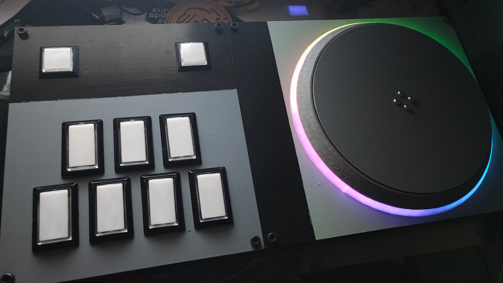

# DIY7K
Raspberry Pi Pico (RP2040)を使用した７鍵コントローラー

自分用なのでコードは雑です。多分更新もしません。

## Usage

Arduino-IDEでuf2ファイルを生成して、Picoに書き込んでください。

依存関係については、以下のDependenciesをご覧ください。

自衛のため、VID/PIDは仮のものになっています。

GPIOのアサインについてはconfig.hをご覧ください。

### Settings

START + SELECT + １鍵を３秒以上長押ししてから離すと、設定モードに入ることができます。

１鍵： 鍵盤LEDモード変更

２鍵： スクラッチLEDモード変更

３鍵： キーボードデバウンスタイム変更 

４鍵： スクラッチ感度変更（値が小さいほど感度が高い）

５鍵： なし

６鍵： スクラッチLEDカラー変更

７鍵： スクラッチLED明るさ変更

START(長押し): EEPROMに設定を保存

SELECT(長押し): 初期値に設定をリセット

## Dependencies

**arduino-pico (LGPL-2.1)**
    * earlephilhower
    * [https://github.com/earlephilhower/arduino-pico]  
  

**Adafruit_TinyUSB_Arduino (MIT)**
    * Copyright (c) 2019 Ha Thach for Adafruit Industries 
    * [https://github.com/adafruit/Adafruit_TinyUSB_Arduino]  
  

**Adafruit_NeoPixel (LGPL-3.0)**
    * adafruit
    * [https://github.com/adafruit/Adafruit_NeoPixel]  
  

## LICENSES
このプロジェクトはソースコードのみの提供です。ほとんどのソースコードはMITライセンスです。詳細は`LICENSE`をご覧ください。
一部のファイルは他のライセンスが適用されています。

The project is licensed under the MIT License - see the `LICENSE` file for details.
However, please note that some files are subject to other licenses.

LGPL-3.0 適用ファイル
`firmware/rp2040/scratchLed.cpp` は、Adafruit_NeoPixelのサンプルコードを改変して作成したため、**LGPL-3.0**が適用されます。ライセンス条文は `LICENSE-LGPL-3.0.txt` を参照してください。

The file `firmware/rp2040/scratchLed.cpp` is licensed under LGPL-3.0 as it is derived from modified sample code from Adafruit_NeoPixel. Please see `LICENSE-LGPL-3.0.txt` for the license text.

このプロジェクトは、サードパーティのコードやライブラリを参照しています。それらのライセンスについては、`NOTICE.txt`をご覧ください。

This project uses third-party libraries. Please see the `NOTICE.txt` file for their respective licenses.
